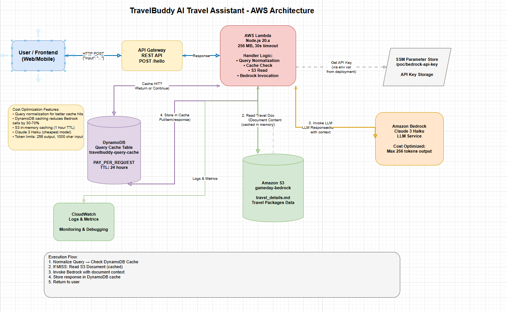

# TravelBuddy AI Travel Assistant - AWS Gameday Project

An AI-powered travel assistant built on AWS that helps users answer queries about travel packages using Amazon Bedrock, DynamoDB, and S3.

## 🎯 Project Overview

**TravelBuddy** is a serverless AI travel assistant that:
- Answers questions about travel packages from Asia (Thailand, Singapore, Malaysia, Indonesia, Vietnam, Japan)
- Uses **Amazon Bedrock** (Claude 3 Haiku) for intelligent responses
- Implements **query caching** with DynamoDB to reduce costs
- Reads travel package information from **S3** with in-memory caching
- Normalizes queries for better cache hit rates

## 🏗️ Architecture



**High-Level Flow:**
```
┌─────────────────┐
│   API Gateway   │  POST /hello
└────────┬────────┘
         │
         ▼
┌─────────────────┐
│  Lambda Handler │  (Node.js 20.x)
│                 │
│  1. Normalize   │
│     Query       │
│  2. Check Cache │  → DynamoDB
│  3. Read S3 Doc │  → S3 (cached)
│  4. Call Bedrock│  → Claude 3 Haiku
│  5. Cache Result│  → DynamoDB
└─────────────────┘
```

### AWS Services Used

| Service | Purpose | Configuration |
|---------|---------|---------------|
| **API Gateway** | REST API endpoint | POST /hello, CORS enabled |
| **Lambda** | Main application logic | Node.js 20.x, 256 MB, 30s timeout |
| **DynamoDB** | Query response cache | PAY_PER_REQUEST, 24h TTL |
| **S3** | Travel package knowledge base | `travel_details.md` |
| **Bedrock** | LLM (Claude 3 Haiku) | API key auth via SSM |
| **SSM Parameter Store** | Secure API key storage | `/poc/bedrock-api-key` |
| **CloudWatch** | Logging & monitoring | Auto-configured |

## ✨ Features

### 1. **Intelligent Query Caching**
- Normalizes queries (removes stop words, punctuation, whitespace)
- Semantic similarity matching: `"What are travel packages from Bengaluru to Bangkok?"` and `"What are the travel packages from Bengaluru to Bangkok?"` → same cache
- Reduces Bedrock API calls by 30-70%
- Cache TTL: 24 hours

### 2. **S3 Document Integration**
- Reads `travel_details.md` from S3 on first request
- In-memory caching (1 hour TTL)
- Full document context included in Bedrock prompts
- Graceful degradation if S3 read fails

### 3. **Cost Optimization**
- **Query normalization** → fewer redundant Bedrock calls
- **DynamoDB caching** → instant responses for cached queries
- **Cheap model**: Claude 3 Haiku (~$0.25 per 1M input tokens)
- **Token limits**: Max 256 output tokens, 1000 char input
- **Connection reuse**: AWS SDK clients initialized outside handler

### 4. **Production-Ready**
- Error handling with graceful degradation
- Comprehensive logging
- CORS enabled for web frontends
- Security: API key via SSM Parameter Store

## 📋 Prerequisites

1. **AWS Account** with appropriate permissions
2. **AWS CLI** configured: `aws configure`
3. **SAM CLI** installed: [Install Guide](https://docs.aws.amazon.com/serverless-application-model/latest/developerguide/install-sam-cli.html)
4. **Node.js 18+** installed
5. **Bedrock API Key** (short-term or long-term from AWS Bedrock console)
6. **S3 Bucket** named `gameday-bedrock` with `travel_details.md` uploaded

## 🚀 Quick Start

### Step 1: Clone and Install

```bash
git clone <your-repo-url>
cd Bedrock-GenAI-Gameday
npm install
```

### Step 2: Enable Bedrock Model Access

1. Go to **AWS Console → Amazon Bedrock**
2. Navigate to **Model access**
3. Enable **Claude 3 Haiku**
4. Fill out the **Anthropic use case form** (required!)
5. Wait ~15 minutes for activation

📖 See [SETUP_BEDROCK.md](./SETUP_BEDROCK.md) for detailed instructions.

### Step 3: Store Bedrock API Key in SSM

```bash
aws ssm put-parameter \
  --name "/poc/bedrock-api-key" \
  --value "YOUR_BEDROCK_API_KEY" \
  --type "String" \
  --region ap-south-1
```

📖 See [SETUP_SSM.md](./SETUP_SSM.md) for detailed instructions.

### Step 4: Upload Travel Document to S3

Ensure your S3 bucket `gameday-bedrock` contains `travel_details.md`:

```bash
aws s3 cp knowledge_base/travel_details.md s3://gameday-bedrock/travel_details.md
```

### Step 5: Build and Deploy

```bash
# Build the application
sam build

# Deploy (first time - guided setup)
sam deploy --guided
```

Or use fast sync for development:

```bash
sam sync --stack-name aws-gameday --watch
```

The `--watch` flag automatically syncs code changes!

📖 See [DEPLOY.md](./DEPLOY.md) or [QUICK_START.md](./QUICK_START.md) for more details.

## 🧪 Testing

### Get API Endpoint

After deployment, get your API endpoint from CloudFormation outputs:

```bash
aws cloudformation describe-stacks \
  --stack-name aws-gameday \
  --query 'Stacks[0].Outputs[?OutputKey==`HelloWorldApi`].OutputValue' \
  --output text
```

### Test with cURL

```bash
curl -X POST https://YOUR-API-ID.execute-api.ap-south-1.amazonaws.com/dev/hello \
  -H "Content-Type: application/json" \
  -d '{"input": "What are the travel packages from Bengaluru to Bangkok?"}'
```

### Test with Node.js

```javascript
const axios = require('axios');

const response = await axios.post(
  'https://YOUR-API-ID.execute-api.ap-south-1.amazonaws.com/dev/hello',
  { input: 'What packages are available in Thailand?' },
  { headers: { 'Content-Type': 'application/json' } }
);

console.log(response.data);
```

### Guardrail Testing

To test Bedrock's content moderation guardrails, see [GUARDRAIL_TEST_PAYLOADS.md](./GUARDRAIL_TEST_PAYLOADS.md) for test cases that verify safety features are working.

## 📊 Request/Response Format

### Request

```json
{
  "input": "What are the travel packages from Bengaluru to Bangkok?"
}
```

### Response

```json
{
  "message": "What are the travel packages from Bengaluru to Bangkok?",
  "bedrockResponse": "Based on the travel packages available...",
  "cached": false,
  "usage": {
    "inputTokens": 450,
    "outputTokens": 120,
    "model": "anthropic.claude-3-haiku-20240307-v1:0"
  },
  "timestamp": "2025-11-01T10:30:00.000Z",
  "requestId": "abc-123-def"
}
```

**Fields:**
- `cached`: `true` if response came from cache, `false` if from Bedrock
- `usage`: Token usage for cost tracking
- `requestId`: AWS request ID for debugging

## 💰 Cost Analysis

### Per Request Cost (Typical)

| Component | Cost |
|-----------|------|
| Lambda | $0.00 (free tier: 1M requests/month) |
| API Gateway | $0.00 (free tier: 1M requests/month) |
| DynamoDB | $0.00 (free tier: 25 GB storage) |
| S3 | $0.0004 per 1000 GET requests |
| Bedrock (Haiku) | ~$0.0001 per request (250 input + 120 output tokens) |
| **Total** | **~$0.0001 per request** |

### Monthly Estimates

| Usage | Estimated Cost |
|-------|----------------|
| 100 requests | <$0.01 |
| 1,000 requests | ~$0.10 |
| 10,000 requests | ~$1.00 |

📖 See [COST_ANALYSIS.md](./COST_ANALYSIS.md) for detailed cost breakdown.

## 🔧 Configuration

### Environment Variables

Configured in `template.yaml`:

| Variable | Description | Default |
|----------|-------------|---------|
| `BEDROCK_MODEL_ID` | Bedrock model to use | `anthropic.claude-3-haiku-20240307-v1:0` |
| `MAX_INPUT_LENGTH` | Max input characters | `1000` |
| `MAX_TOKENS` | Max output tokens | `256` |
| `S3_BUCKET_NAME` | S3 bucket for travel docs | `gameday-bedrock` |
| `S3_DOCUMENT_KEY` | S3 key for travel doc | `travel_details.md` |
| `DYNAMODB_TABLE_NAME` | DynamoDB cache table | `travelbuddy-query-cache` |

### Changing the Model

Edit `template.yaml`:

```yaml
BEDROCK_MODEL_ID: "anthropic.claude-3-sonnet-20240229-v1:0"  # More capable, more expensive
```

⚠️ **Cost Warning**: Claude Opus is 10x more expensive! Stick with Haiku for practice.

## 🛠️ Development

### Project Structure

```
.
├── src/
│   └── index.js              # Main Lambda handler
├── template.yaml             # SAM template (Infrastructure as Code)
├── package.json              # Node.js dependencies
├── samconfig.toml            # SAM deployment config
└── knowledge_base/
    └── travel_details.md     # Travel packages data
```

### Local Development

```bash
# Install dependencies
npm install

# Run locally with SAM (requires Docker)
sam local start-api

# Test locally
curl -X POST http://localhost:3000/hello \
  -H "Content-Type: application/json" \
  -d '{"input": "Hello"}'
```

### Updating Code

With `sam sync --watch`, code changes are automatically synced:

```bash
sam sync --stack-name aws-gameday --watch
# Edit src/index.js, save → automatically synced!
```

## 🔍 How It Works

### Execution Flow

1. **API Request** → API Gateway receives POST `/hello` with `{"input": "..."}`

2. **Query Normalization** → Normalize input:
   - Lowercase
   - Remove punctuation
   - Remove stop words ("the", "are", "from", etc.)
   - Example: `"What are the packages from BLR to BKK?"` → `"packages blr bkk"`

3. **Cache Check** → DynamoDB lookup with normalized hash:
   - **Cache HIT** → Return cached response (no Bedrock call!)
   - **Cache MISS** → Continue to step 4

4. **Get Travel Document** → Read from S3 (or use in-memory cache):
   - First request: Read from S3, cache in Lambda memory
   - Subsequent requests: Use cached version (1 hour TTL)

5. **Invoke Bedrock** → Send to Claude 3 Haiku:
   - System prompt: "You are a helpful travel assistant..."
   - User prompt: Travel document + user query
   - Get response

6. **Cache Response** → Store in DynamoDB:
   - Key: Normalized query hash
   - Value: Response, usage, timestamp
   - TTL: 24 hours

7. **Return Response** → Send to API Gateway → User

### Cache Normalization Examples

These queries will hit the same cache:

| Query 1 | Query 2 | Normalized (Same) |
|---------|---------|-------------------|
| "What are the travel packages from BLR to Bangkok?" | "What are travel packages from Bengaluru to Bangkok?" | `"travel packages blr bangkok"` |
| "Show me packages to Thailand" | "Show me the packages to Thailand" | `"show packages thailand"` |
| "Bangkok package cost?" | "What is the cost of Bangkok package?" | `"bangkok package cost"` |

## 🐛 Troubleshooting

### Common Issues

**Error: "Model use case details have not been submitted"**
- Fill out the Anthropic use case form in Bedrock console
- Wait 15 minutes after submission
- See [SETUP_BEDROCK.md](./SETUP_BEDROCK.md)

**Error: "Bedrock API Key not configured"**
- Verify SSM parameter exists: `aws ssm get-parameter --name "/poc/bedrock-api-key"`
- Redeploy stack: `sam sync --stack-name aws-gameday`
- See [SETUP_SSM.md](./SETUP_SSM.md)

**Error: "AccessDeniedException"**
- Verify Bedrock model is enabled in console
- Check API key is valid and not expired
- Verify IAM permissions

**Error: "ValidationException: messages: Unexpected role 'system'"**
- This is fixed in current code (system is top-level parameter)
- Redeploy if you see this error

**Cache not working?**
- Check DynamoDB table exists: `aws dynamodb describe-table --table-name travelbuddy-query-cache`
- Check Lambda logs for cache hit/miss messages
- Verify query normalization is working (check logs for "Normalized query")

**S3 read errors?**
- Verify bucket name: `gameday-bedrock`
- Verify file exists: `aws s3 ls s3://gameday-bedrock/travel_details.md`
- Check Lambda IAM role has S3 read permissions

## 📚 Documentation

- **[QUICK_START.md](./QUICK_START.md)** - Fast deployment guide
- **[DEPLOY.md](./DEPLOY.md)** - Detailed deployment instructions
- **[SETUP_BEDROCK.md](./SETUP_BEDROCK.md)** - Bedrock setup steps
- **[SETUP_SSM.md](./SETUP_SSM.md)** - SSM Parameter Store setup
- **[COST_ANALYSIS.md](./COST_ANALYSIS.md)** - Detailed cost breakdown
- **[GAMEDAY_REQUIREMENTS.md](./GAMEDAY_REQUIREMENTS.md)** - Project requirements (outdated - mentions OpenSearch)

## 🔐 Security

- ✅ Bedrock API key stored in SSM Parameter Store (not in code)
- ✅ API key resolved at deployment time (no runtime SSM calls)
- ✅ IAM roles follow least privilege (specific service permissions)
- ✅ CORS configured for API Gateway
- ✅ Input validation (length limits)

## 🎯 Gameday Tips

1. **Pre-warm Cache**: Run common queries before the event
2. **Monitor Costs**: Set up CloudWatch billing alarms
3. **Test Endpoints**: Verify API works before event
4. **Check Logs**: CloudWatch Logs → `/aws/lambda/aws-gameday-lambda`
5. **S3 Document**: Ensure `travel_details.md` is uploaded and accessible

## 📝 License

ISC License

## 🤝 Contributing

This is a Gameday practice project. Contributions welcome!

## 📞 Support

For issues, check:
1. CloudWatch Logs for Lambda errors
2. This README's Troubleshooting section
3. Individual setup guides (SETUP_BEDROCK.md, SETUP_SSM.md)

---

**Built for AWS Gameday 2025** 🚀

